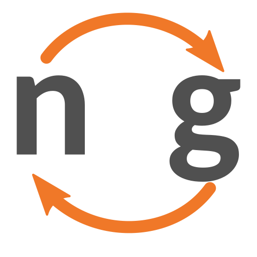

# ngshare
[nbgrader](https://github.com/jupyter/nbgrader) sharing service.

[](https://github.com/psf/black)
[](https://travis-ci.org/lxylxy123456/ngshare)
[](https://codecov.io/gh/lxylxy123456/ngshare)
[](https://ngshare.readthedocs.io/en/latest/?badge=latest)

**This service is under development. Use this at your own risk.**

Click [here](#installation-and-setup) for installation instructions.




## What can I use it for?
You can use ngshare if you
* Need to run nbgrader on a distributed set up (probably using
 [lxylxy123456/nbgrader](https://github.com/lxylxy123456/nbgrader))
* Have something similar to nbgrader that also needs an API to manage courses,
 homework submissions and feedbacks, etc.
* Want to learn Flask, SQLAlchemy, or Tornado Web Server. 

## APIs
The API specifications for `ngshare` are available in
 [`api-specifications.md`](api-specifications.md).

## Installation and setup
* See [/testing](/testing#testing-setup) for setting up `ngshare` and `JupyterHub` for simple testing.

To install `ngshare` onto your cluster with some default values, simply do:

`helm install ngshare helmchart/ngshare`

We recommend using some configurations manually. Here's a sample `config.yaml` file:
```yaml
deployment:
  resources:
    limits:
      cpu: 100m
      memory: 128Mi

ngshare:
  # You may omit this, but the token will be randomly generated.
  # It's recommended to specify an API token here.
  hub_api_token: ENTER_TOP_SECRET_TOKEN_HERE

pvc:
  # Amount of storage for ngshare
  storage: 1Gi
```
For a reference of all the options you can specify, check [here](/helmchart/ngshare/values.yaml).

After you install, you should see a message like this:
```
Congrats, ngshare should be installed!
To get started, add the following to your JupyterHub helm chart's values:

hub:
  extraConfig:
    ngshare.py: |
      c.JupyterHub.services.append({
        'name': 'ngshare',
        'url': 'http://ngshare:8080',
        'api_token': 'a4IHeiHZuswZrmYbWxSGpLZs3x0pXVxa'})
```
You should:
1. Follow the first part of the instructions, and add the `extraConfig` part into your JupyterHub's helm chart.
2. Modify your singleuser image to install our fork of nbgrader, and add some configuration to your default `nbgrader_config.py` so it uses ngshare. You can add something like this to your singleuser Dockerfile:
```dockerfile
RUN pip install git+https://github.com/lxylxy123456/nbgrader@exchange_server && \
jupyter nbextension install --symlink --sys-prefix --py nbgrader && \
jupyter nbextension enable --sys-prefix --py nbgrader && \
jupyter serverextension enable --sys-prefix --py nbgrader

COPY nbgrader_config.py /etc/jupyter/
```
with an accompanying `nbgrader_config.py` like this:
```python
from nbgrader.exchange import ngshare
c = get_config()
c.ExchangeFactory.exchange = ngshare.Exchange
c.ExchangeFactory.fetch_assignment = ngshare.ExchangeFetchAssignment
c.ExchangeFactory.fetch_feedback = ngshare.ExchangeFetchFeedback
c.ExchangeFactory.release_assignment = ngshare.ExchangeReleaseAssignment
c.ExchangeFactory.release_feedback = ngshare.ExchangeReleaseFeedback
c.ExchangeFactory.list = ngshare.ExchangeList
c.ExchangeFactory.submit = ngshare.ExchangeSubmit
c.ExchangeFactory.collect = ngshare.ExchangeCollect
```
Afterwards, the setup should be complete.

## Note about users in JupyterHub and ngshare
In ngshare, all users (instructors and students) are identified using their username in JupyterHub. They are authenticated using the API token inside their notebook server. Be careful when reusing usernames in JupyterHub, as users with the same name will be identified as the same. We haven't added functionality to rename or delete users in ngshare, so be sure not to delete a user and create a new one with the same name. If you do, you will have to manually edit the ngshare database to remove or rename that user.

## Demo
If you are configuring our project correctly, you should be able to run this demo.
1. Setup a clean environment using JupyterHub + nbgrader + ngshare (debug mode). You can use the [minikube testing setup](/testing#testing-setup) to do it easily.
2. Login as user "user". All usernames are login-able with any passwords.
3. Go to "Control Panel" at upper right corner, then Services -> ngshare
4. Click on "init with test data". You should see
	`{"success": true, "message": "done"}`.
5. Login as user "kevin".
6. Create a new file with New -> Text File, name it `nbgrader_config.py` and
	with the following content:
```
c = get_config()
c.CourseDirectory.course_id = "course1"
```
7. Go to "Control Panel", click on "Stop My Server"
8. Click on "Start My Server"
9. Go to "Formgrader".
10. Click "Add new assignment..."
11. Click on the name of the assignment you just added
12. New -> Notebook -> Python 3, and edit the notebook as in normal nbgrader
	1. Add some code to the block
	2. View -> Cell Toolbar -> Create Assignment
	3. Select "Autograded answer"
	4. ...
	5. Save notebook
13. Click "Generate" in Formgrader
14. Click "Release" in Formgrader
15. Login as user "lawrence" (you may want to use incognito mode).
16. Go to "Assignments" tab
17. Click "Fetch" for the new assignment (the one that is not "challenge")
18. Do your homework.
19. Click "Submit".
20. Login as user "kevin".
21. Click "Collect" in Formgrader. 
22. You should see "1" under "# Submissions". Click on this number. 
23. Click "Autograde"
24. Click Student Name, and then the notebook name, then write some feedback and
	click "Next".
25. Go back to "Manage Assignments"
26. Click "Generate Feedback", and "Release Feedback" in order.
27. Login as user "lawrence".
28. Under "Assignments", click "Fetch Feedback"
29. You should see "(view feedback)" on the right of the time stamp, but do not
	click on it. 
30. Go to "Files" tab and go to `<assignment name>/feedback/<timestamp>`, then
	you can view the html feedbacks. 

### Youtube Video Demo
http://www.youtube.com/watch?v=iiaVpKLj89c

[](http://www.youtube.com/watch?v=iiaVpKLj89c)

## Database migrations
ngshare uses [Alembic](https://alembic.sqlalchemy.org/) to manage database
 migrations.

For development, first install ngshare as a repo using
 `pip3 install . --user --upgrade`, then initialize the database using
 `python3 dbutil.py upgrade head` (the path to database is defined in
 `dbutil.py`, which is `sqlite:////tmp/ngshare.db` by default).

After changing database structure, use `pip3 install . --user --upgrade` and
 then `python3 dbutil.py revision --autogenerate -m "message"` to automatically
 detect changes, then `python3 dbutil.py upgrade head` to upgrade database
 structures.

Ngshare / vngshare automatically checks database upgrade each time it starts up.
 You are expected to have a good way to backup your database before running
 ngshare / vngshare in case alembic corrupts the database. If you want to stop
 this behavior you can use `--no-upgrade-db`. If you do this, you must manually
 upgrade the database when upgrading ngshare. Only use this option if you know
 EXACTLY what you're doing, otherwise using incompatible versions will cause
 things to break catastrophically.

## Code formatting
`black -S -l 80 ngshare`

