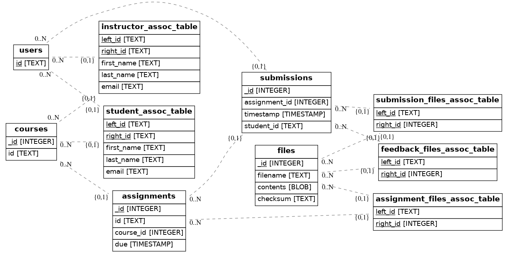

Database Structure
==================

ngshare is using `SQLAlchemy <https://www.sqlalchemy.org/>`_ to model data relationships and manage database queries.

Tables
------
* ``User``: analogous to users of JupyterHub. A user can be a student, instructor,
  or both.

* ``Course``: a course for nbgrader, can have multiple students and instructors.

* ``Assignment``: an assignment, has multiple states; belongs to a course.

* ``Submission``: a student's submission to an assignment; includes submission
  and feedback; belongs to an assignment.

* ``File``: Store files related to 1) assignment, 2) submission, or 3) feedback.

Allocation Tables
-----------------
Allocation tables are created by SQLAlchemy to represent many-to-many relationships. You should not worry about them when designing a high-level database structure.

* ``instructor_assoc_table``: Relationship between instructor (``User``) and
  ``Course``

  * Also contains metadata: ``first_name``, ``last_name``, ``email``

* ``student_assoc_table``: Relationship between student (``User``) and
  ``Course``

  * Also contains metadata: ``first_name``, ``last_name``, ``email``

* ``assignment_files_assoc_table``: Relationship between ``Assignment`` and
  ``File``

* ``submission_files_assoc_table``: Relationship between ``Submission`` and
  ``File``

* ``feedback_files_assoc_table``: Relationship between feedback (``Submission``)
  and ``File``

Assignment State
----------------
Currently, the ``Assignment`` table has a boolean column ``released``. It may be used in future versions of ngshare to manage assignment states.

Entity Relationship Diagram
---------------------------

To generate a graph using `ERAlchemy <https://pypi.org/project/ERAlchemy/>`_:

.. code:: bash

    pip3 install eralchemy
    cd ngshare
    python3 dbutil.py upgrade head
    eralchemy -i sqlite:////tmp/ngshare.db -o database/er.png

Current Entity Relation Diagram
^^^^^^^^^^^^^^^^^^^^^^^^^^^^^^^

Note: this image is manually maintained.

