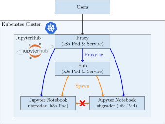
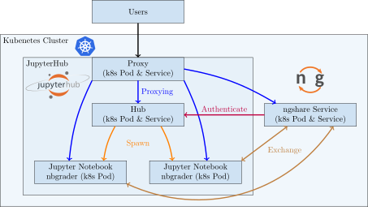

nbgrader Integration with JupyterHub and Kubernetes
===================================================

Kevin Rong | Abigail Almanza | Lawrence Lee | Eric Li

Team KALE

Preface
=======

Readme
------

This is the user guide for the nbgrader Integration with Jupyter Lab project. This document gives an overview of the problem and the solution proposed by this project, and explains how to install and maintain this project. 

Intended Audience
-----------------
This document is for system administrators who need to run nbgrader on a distributed set up like Kubernetes. Some background knowledge on how Kubernetes and JupyterHub works will be helpful when reading this documentation.

Text Conventions
----------------
N/A

Acknowledgments
---------------
Special thanks to Professor Nitta, Professor Moore, the UC Davis Jupyter Team, and Jupyter contributors for their support with this senior design project.

Related Documentation
---------------------
* nbgrader: `https://nbgrader.readthedocs.io/en/stable/ <https://nbgrader.readthedocs.io/en/stable/>`_
* JupyterHub: `https://jupyterhub.readthedocs.io/en/stable/ <https://jupyterhub.readthedocs.io/en/stable/>`_
* Kubernetes: `https://kubernetes.io/docs/home/ <https://kubernetes.io/docs/home/>`_
* TODO

Project Overview
================

Background
----------
UC Davis JupyterHub will be used for course instruction. Students will be able to complete and submit assignments through JupyterHub and instructors can grade assignments. nbgrader will be used to add such functionality to UC Davis JupyterHub, but there are issues. When JupyterHub is deployed as a Kubernetes cluster, nbgrader is unable to automatically distribute and collect assignments since there isn’t a shared filesystem. Also, nbgrader is not compatible with JupyterLab, an improved version of the Jupyter Notebook frontend.

Goals
-----
* Create a JupyterHub service that allows nbgrader to work on a Kubernetes set up
* Create an nbgrader exchange plugin to enable the use of our service
* Provide good testing coverage of our service and plugin
* Package ngshare for easy installation through pip
* Write clear documentation to facilitate the maintenance of our service by the UC Davis Jupyter Team
* Port nbexchange extensions to JupyterLab

Technical Specifications
------------------------
TODO

Features
--------
1. Sharing files between different Kubernetes pods without relying on a shared
   file system.
2. Managing courses, instructors, and students for ngshare. 
3. Easy interface for administrators to debug ngshare database. 
4. Open source projects with continuous integration, code coverage, and online
   documentation.

TODO

Future Application
------------------
Although this project is specifically built for nbgrader and Kubernetes, it can be ported to use other container cluster managers like Docker Swarm and Apache Mesos. The ngshare part of this project can be used as a template when developing other projects that require specialized sharing between containers. 

TODO

Installation
============
``ngshare`` is designed to be installed on a Z2JH cluster, but you may install it without Kubernetes.

.. toctree::
   :maxdepth: 2

   install_z2jh.rst
   install_jupyterhub.rst
   install_unmanaged.rst
   uninstall.rst
   upgrade.rst

Demo
====
For this demo, you need to setup a clean environment using JupyterHub + nbgrader + ngshare. 
.. You can use the [minikube testing setup](/testing#testing-setup) to do it easily.

Creating Course
---------------
1. Login as user "admin". 
2. Open a terminal using "New -> Terminal"
3. Create a course with two instructors using

.. code::

    ngshare-course-management create_course ECS193 kevin abigail

.. All usernames are login-able with any passwords.

Adding Students
---------------
1. Login as user "kevin".
2. Open a terminal using "New -> Terminal"
3. Add students to the course using

.. code::

    ngshare-course-management add_student ECS193 lawrence -f lawrence_first -l lawrence_last -e lawrence@email
    ngshare-course-management add_student ECS193 eric -f eric_first -l eric_last -e eric@email

4. Create a new file with "New -> Text File", name it ``nbgrader_config.py`` and add the following content:

.. code::

    c.CourseDirectory.course_id = "ECS193"

5. Go to "Control Panel", click on "Stop My Server"
6. Click on "Start My Server"
7. Go to "Formgrader -> Manage Students". You should see the two students created before.

Releasing Assignment
--------------------
0. Make sure you are logged in as user "kevin".
1. Go to "Formgrader -> Manage Assignments".
2. Click "Add new assignment...".
3. Click on the name of the assignment you just added.
4. "New -> Notebook -> Python 3", and edit the notebook as in normal nbgrader.

	1. Add some code to the block.
	2. "View -> Cell Toolbar -> Create Assignment".
	3. Select "Autograded answer".
	4. ...
	5. Save notebook.

5. Click the button under "Generate" in Formgrader.
6. Click the button under "Release".

Doing Assignment
----------------
1. Login as user "lawrence" (you may want to use incognito mode).
2. Go to "Assignments" tab.
3. Click "Fetch" for the new assignment.
4. Click on the assignment name and the ipyndb name to open the homework.
5. Do your homework.
6. Click "Submit" in "Assignments -> Downloaded assignments".

Grading Assignment
------------------
0. Make sure you are logged in as user "kevin".
1. Go to "Formgrader -> Manage Assignments".
2. Click the button under "Collect" in Formgrader. 
3. You should see "1" under "# Submissions". Click on this number. 
4. Click the button under "Autograde" in Manage Submissions. 
5. Click Student Name, and then the notebook name to open the submission.
6. Write some feedback for the student.
7. Click "Next" at upper right corner.
8. Go back to "Manage Assignments".
9. Click the button under "Generate Feedback".
10. Click the button under "Release Feedback".

Viewing Feedback
----------------
0. Make sure you are logged in as user "lawrence".
1. Under "Assignments", click "Fetch Feedback"
2. Click "(view feedback)". 
3. Click notebook name.
4. Now you can see the html feedback. 

Troubleshooting
===============
TODO

Frequently Asked Questions
==========================

Is there any overhead on other Jupyter applications after I install this?
-------------------------------------------------------------------------
TODO

Theoretically, this project brings minimal overhead to other Jupyter applications.

Starting ``ngshare`` requires some CPU time and memory. If no one is using the service only ``/healthz`` will be accessed. The overhead should be neglectable in most modern systems. 

If no one is using ``nbgrader``, ... (TODO)

How do I update nbgrader / ngshare?
-----------------------------------
TODO

Can I uninstall ngshare?
------------------------
TODO

Do I need to backup database?
-----------------------------
Yes, you should regularly backup your database in case of corruption. 

The database should be backed up before updating ngshare because the schema and data migration may corrupt the database.

Will attackers be able to clear ngshare database?
-------------------------------------------------
Though there is a "clear database" button in ngshare welcome page, this functionality is disabled as long as you are not starting ngshare in debug mode (which is the default configuration for ngshare). So attackers cannot directly clear your database even if they log in as an admin user in ngshare. 

Glossary
========
* `Jupyter (notebook) <https://jupyter.org/>`_: web application to create and share documents that contain live code, equations, visualizations etc.
* `JupyterLab <https://jupyter.org/>`_: web-based interactive development environment for Jupyter notebooks, code and data.
* `JupyterHub <https://jupyter.org/>`__: A multi-user version of the notebook designed for companies, classrooms and research labs.
* `Zero-to-JupyterHub <https://zero-to-jupyterhub.readthedocs.io/en/latest/>`_: A version of JupyterHub, for use with a Kubernetes cluster.
* `nbgrader <https://nbgrader.readthedocs.io/en/stable/>`_: facilitates creating and grading assignments in the jupyter notebook.
* `kubernetes (k8s) <https://kubernetes.io>`_: system for automating, deployment, scaling, and management of containerized applications.
* `hubshare <https://github.com/jupyterhub/hubshare>`_: a directory sharing service for JupyterHub, currently in early development.
* `ngshare <https://github.com/lxylxy123456/ngshare>`_: an original backend server for nbgrader's exchange service.

Contact Information
===================

Team Members
------------
* Kevin Rong <`krong@ucdavis.edu <krong@ucdavis.edu>`_>
* Abigail Almanza <`aalmanza@ucdavis.edu <aalmanza@ucdavis.edu>`_>
* Lawrence Lee <`billee@ucdavis.edu <billee@ucdavis.edu>`_>
* Eric Li <`ercli@ucdavis.edu <mailto:ercli@ucdavis.edu>`_>

Clients
-------
* Christopher Nitta <`cjnitta@ucdavis.edu <cjnitta@ucdavis.edu>`_>
* Jason K. Moore <TODO>

Jupyter Community
-----------------
Reached by posting issues in Github repos like https://github.com/jupyter/nbgrader/

Deployment
----------
* UC Davis Jupyter team <TODO>

Appendix
========

Technology Survey
-----------------
.. Ori: contributer_guide/why_ngshare.html#alternative-solutions

hubshare
^^^^^^^^

`hubshare <https://github.com/jupyterhub/hubshare>`_ is a directory sharing service for JupyterHub.

Pros
""""

* Universal solution which can be integrated with nbgrader.

* Considered for a similar service desired by the primary nbgrader developer
  (see
  `jupyter/nbgrader#659 <https://github.com/jupyter/nbgrader/issues/659>`_).

Cons
""""

* Lots of work to implement HubShare.

* The nbgrader exchange needs to be reworked.

* Too generic, as it does not have permission control specific to courses and
  assignments (see
  `this comment <https://github.com/jupyter/nbgrader/issues/659#issuecomment-431762792>`_).

NFS
^^^

Another solution is to let every container access a shared file system
through NFS (Network File System).

Pros
""""

* Simple and doable.

* Requires minimal changes and additions to the Jupyter project.

Cons
""""

* Not a universal solution. NFS setups will vary across deployments.

Kubernetes Persistent Volume Claim
^^^^^^^^^^^^^^^^^^^^^^^^^^^^^^^^^^

`Kubernetes Persistent Volume Claim
<https://kubernetes.io/docs/concepts/storage/persistent-volumes/#persistentvolumeclaims>`_
allows containers to request shared file systems.

Pros
""""

* More universal than the NFS solution.

* Requires minimal changes and additions to the Jupyter project.

Cons
""""

* Difficult to work around limitations regarding multiple writers per
  volume. Need to find a way to have correct permissions for students and
  instructors.

* Does not work with `some volume plugins <https://kubernetes.io/docs/concepts/storage/persistent-volumes/#access-modes>`_.

ngshare
^^^^^^^

ngshare implements a set of :doc:`REST APIs </api/index>` designed
for the nbgrader exchange mechanism.

Pros
""""

* Universal solution which can be integrated with nbgrader.

* **Full control over APIs in this project.**

Cons
""""

* Work needs to be done to implement ngshare.

* The nbgrader exchange needs to be reworked.

Requirements
------------

User Stories
^^^^^^^^^^^^
* As a campus IT service provider, I want to be able to run nbgrader on kubernetes, so the teachers can easily direct students to use nbgrader on the service I provide in their programming classes.
* As a programming class teacher, I want nbgrader to be able to run on the JupyterLab interface. It would give students access to a more user-friendly programming environment.
* As a course instructor, I want nbgrader to warn me when I’m about to publish an edited assignment from “preview” mode in order to minimize the risk of accidentally releasing something I wrote for testing purposes.
* As a course instructor / TA, I want a button that runs the nbgrader autograder for all students’ submissions so that I don’t have to click “autograde” for every submission.
* As a course instructor / TA, I want to be able to manually grade one question across all submissions so that I can grade question by question instead of submission by submission.
* As a course instructor / TA, I want to be able to write a rubric before grading and then use it to quickly assign points to a problem, instead of typing in grade and feedback for each student’s submission. This functionality can be similar to what Gradescope provides.
* As a course instructor, I want to be able to automatically create links in Canvas that directs students to the corresponding JupyterHub / JupyterLab page.
* As a course instructor, I want a way to automatically upload all grades from an nbgrader assignment to Canvas.
* As a course instructor / TA, I want to make sure that nbgrader is running the student’s submission in a sandbox environment, so that if a student writes malicious code, the code will not affect me and other students.
* As a course instructor, I want to be able to assign each TA a separate JupyterHub account, and they can grade the assignment for the same course. It is favorable to record who graded which assignment / submission.
* As a course instructor / TA, I want to be able to work on multiple courses with only one account to the system. Currently I have to have one account for each course I am grading.
* As a non-English speaker / teacher, I hope nbgrader can have a internationalized interface (e.g. Chinese, Japanese) so that it is more friendly to my students. 
* As a teacher, I would like to easily import student roster from Canvas when the quarter begins. And when I notice students add , drop, or switch sections of the course, I would like to have a way to easily manage the change. 
* As a instructor, I would like to have a back button in formgrader (url is /user/<username>/formgrader) of ngshare so that I can easily go back to my JupyterHub homepage after I grade a homework 
* As a instructor / TA, I hope ngshare can have a way to handle regrade requests, instead of having all students email me and looking for each student in the system when handling each regrade request. 
* As a Windows server cluster manager, I hope nbgrader and ngshare can support more platforms by fixing problems like path name translation. 

Prototyping code
----------------
* https://github.com/lxylxy123456/ngshare
* https://github.com/lxylxy123456/nbgrader
* https://github.com/rkevin-arch/zero-to-jupyterhub-k8s
* https://github.com/rkevin-arch/kubespawner_service_jupyterhub
* https://github.com/lxylxy123456/ngshare-vserver
* https://github.com/lxylxy123456/ngshare_exchange

Technologies Employed
---------------------
.. Ori: contributer_guide/decisions.html#technologies-employed

When developing ``ngshare``, we used many technologies that are used by other Jupyter projects, especially ``nbgrader`` and `JupyterHub <https://github.com/jupyterhub/jupyterhub>`__. In this way, our project is most likely to be consistent with other Jupyter projects.

Backend
^^^^^^^
* `JupyterHub <https://github.com/jupyterhub/jupyterhub>`_ - A multi-user
  version of Jupyter Notebook (indirectly used)
* `kubernetes <https://kubernetes.io/>`_ - Underlying container management
  system (indirectly used)
* `minikube <https://kubernetes.io/docs/setup/learning-environment/minikube/>`_ -
  A light-weight testing environment for kubernetes (indirectly used)
* `Tornado web server <https://www.tornadoweb.org/>`_ - A Python web framework
  used in Jupyter community

Database
^^^^^^^^
* `SQLAlchemy <https://www.sqlalchemy.org/>`_ - A Python SQL toolkit
* `SQLite3 <https://www.sqlite.org/index.html>`_ - a light weight database
  engine
* `Alembic <https://alembic.sqlalchemy.org/>`_ - SQLAlchemy migration tool
* `ERAlchemy <https://github.com/Alexis-benoist/eralchemy>`_ - Generate entity
  relation diagrams

Progamming Language
^^^^^^^^^^^^^^^^^^^
* `Python <https://www.python.org/>`_ - The major programming language used to
  develop ``nbgrader``
* `pytest <https://pypi.org/project/pytest/>`_ - Unit test framework
* `pytest-cov <https://pypi.org/project/pytest-cov/>`_ - Code coverage
* `pytest-tornado <https://pypi.org/project/pytest-tornado/>`_ - Test Tornado
  server
* `black <https://github.com/psf/black>`_ - a Python code formatter

Project Management
^^^^^^^^^^^^^^^^^^
* `GitHub <https://github.com/>`_ - a git repository management website
* `Travis CI <https://travis-ci.org/>`_ - Continous integration
* `Codecov <https://codecov.io/>`_ - Code coverage
* `Read the Docs <https://readthedocs.org/>`_ - Documentation

System Architecture Overview
----------------------------

Legal & Social Aspects
----------------------
Our project will be delivered in a way that does not involve deployment on our (the developer’s) side, so the users are responsible for deploying the project and setting up terms and conditions regarding their use of our project and collecting their user data.

Our project will be an extension on an existing open source project. The existing project is using the BSD license, which allows anyone to use and modify the software. The open source license disclaims all warranties, so there is not much we can say about the social and legal aspect of the product.

Our project will make a social impact on all current nbgrader users and possibly IT service providers for programming courses. Our project makes it possible to have centralized kubernetes or other container clusters maintained by IT service providers and used by individual programming class instructors. This feature may also let nbgrader be more popular.

